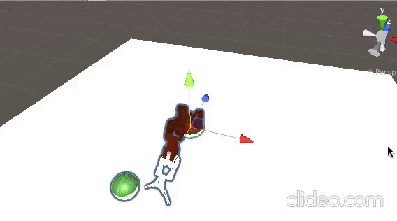
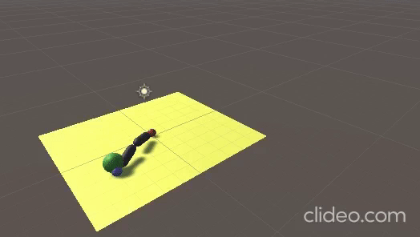
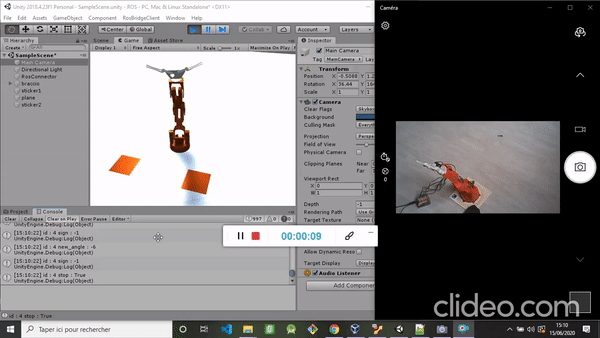

# ROS_Unity

## Repository with robot simulation with Unity ml-agent and manipulation with ROS

### ml-agent is a Unity package which enable the training of agents on Unity physics engine. Linked repo : 

#### Braccio robot (5 ddl) trained with PPO on a reaching task using Unity Transforms

#### Arm robot (3 ddl) trained with PPO on a reaching task using Unity RigidBodies.

### Ros# is a package Unity/Ros package for communication between Unity simulation scene and ROS/Gazebo. It also enable conversion of urdf files to Unity gameObject.

#### Braccio robot following the movements of virtual Unity Braccio Robot. Base rotation need to be fixed.

[alt text](https://github.com/sabeaussan/ROS_Unity/blob/master/WebCam.png?raw=true)

#### TODO :
- Fix braccio rotation
- Add sim2real transfer 
  linked articles : 

